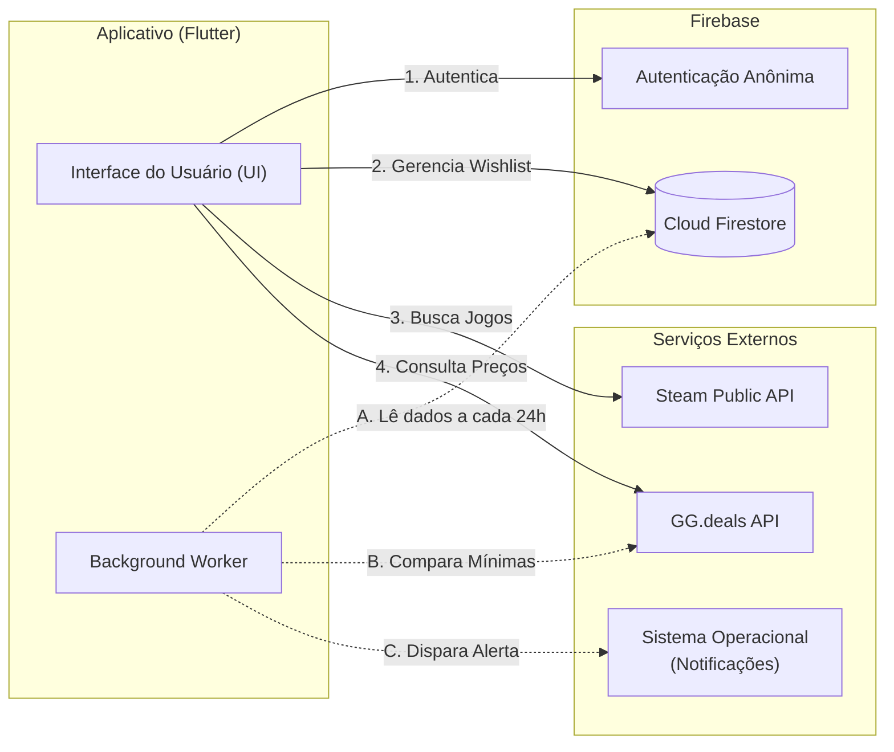
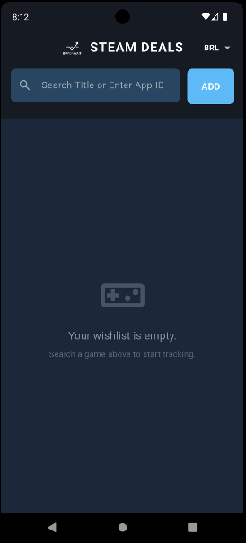
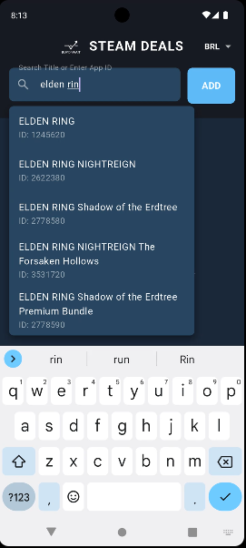
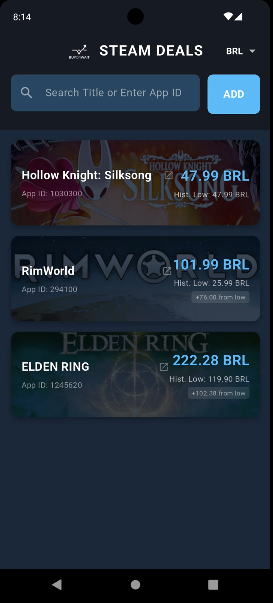

# 🎮 Buy or Wait: Steam Deals Tracker

Um aplicativo móvel desenvolvido em Flutter que ajuda os usuários a rastrear preços de jogos, identificando as mínimas históricas e enviando notificações quando os preços caem. O aplicativo utiliza a Steam como base para o catálogo e cruza os dados para checar descontos em uma lista selecionada de lojas oficiais, utilizando o ecossistema do Firebase para armazenamento e autenticação.

## 🚀 Funcionalidades

  * Busca Integrada: Consome a API pública da Steam para buscar jogos pelo título em tempo real com auto-completar, garantindo uma biblioteca de jogos padronizada e coerente.
  * Rastreamento Curado de Preços: Consome a API do GG.deals utilizando o ID da Steam do jogo para buscar o preço atual e a mínima histórica absoluta. O rastreamento foca em uma seleção curada de lojas parceiras oficiais (como Steam, Epic Games, GOG, Humble Bundle, Nuuvem e Fanatical), filtrando ruídos de revendedores obscuros.
  * Conversão de Moedas: Suporte dinâmico para múltiplas regiões e moedas (USD, GBP, EUR, BRL).
  * Wishlist em Nuvem: Os jogos salvos são armazenados no Cloud Firestore, permitindo persistência de dados vinculada à sessão do usuário via Firebase Anonymous Authentication.
  * Trabalho em Segundo Plano: Utiliza o pacote workmanager para rodar tarefas invisíveis a cada 24 horas, atualizando os preços automaticamente em background.
  * Notificações Locais: Alertas nativos via flutter\_local\_notifications disparados pelo sistema caso o app detecte uma queda de preço para um valor abaixo do registrado na sua wishlist.

## 🛠️ Tecnologias Utilizadas

  * Frontend: Flutter & Dart
  * Backend as a Service: Firebase (Authentication & Cloud Firestore)
  * APIs Consumidas:
      * Steam Store Search API (Busca de IDs)
      * Steam AppDetails API (Busca de imagens/capas)
      * GG.deals API (Precificação nas lojas oficiais selecionadas)
  * Pacotes Principais: http, shared\_preferences, workmanager, flutter\_local\_notifications, url\_launcher.

## 🏗️ Arquitetura da Aplicação

Abaixo está o desenho da arquitetura do sistema, detalhando o fluxo de dados entre o aplicativo, o Firebase e as APIs externas.



## ⚙️ Como Instalar e Executar

Siga os passos abaixo para rodar o projeto localmente:

1.  Clone o repositório:

    ```bash
    git clone https://github.com/lucasgerbasi/BuyOrWait/
    cd BuyOrWait
    ```

2.  Instale as dependências do Flutter:

    ```bash
    flutter clean
    flutter pub get
    ```

3.  Configuração do Firebase (Android):

      * Certifique-se de ter um projeto criado no Firebase Console.
      * Ative o banco de dados Firestore e o provedor de login anônimo no Authentication.
      * Adicione o arquivo google-services.json no diretório android/app/.

4.  Execute a aplicação:

      * Certifique-se de ter um emulador rodando ou um dispositivo físico conectado.

    <!-- end list -->

    ```bash
    flutter run
    ```

    Nota: Se encontrar erros de compilação relacionados ao Android, este projeto exige o NDK versão 27.0.12077973 e minSdkVersion 23.

## 📱 Prints da Aplicação

\<div align="center"\>
\
\
\
\</div\>

## ⚠️ Segurança

Seguindo as boas práticas de segurança, o arquivo com a chave da API do GG.deals (keys.env) foi incluído no .gitignore e não está no repositório público.

Para testar o aplicativo:

1.  Opção Mais Fácil: Baixe e instale o .apk fornecido na aba Releases. O APK já contém as chaves compiladas e está 100% funcional.
2.  Para rodar o código-fonte: Você precisará criar um arquivo chamado keys.env dentro da pasta assets/ contendo a sua própria chave da API:
    `GG_DEALS_API_KEY=sua_chave_aqui`

## 📦 Download do APK

Você pode baixar a versão final compilada do aplicativo (.apk) para testar diretamente em um dispositivo Android:

📥 [Baixar Buy or Wait APK (v1.0.0)](https://github.com/lucasgerbasi/BuyOrWait/releases/tag/1.0)
