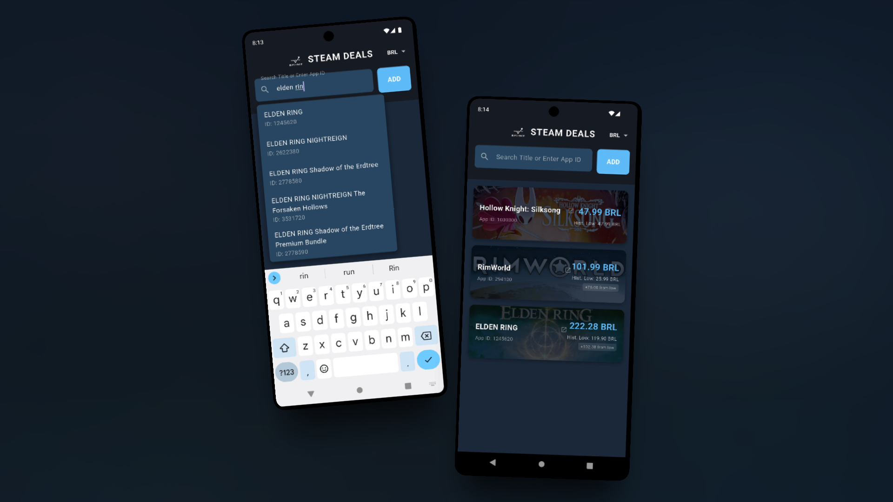
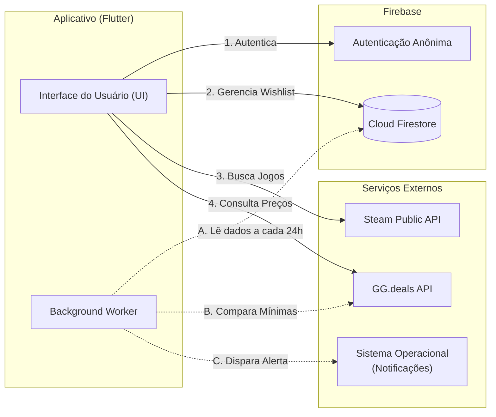

# 🎮 Buy or Wait: Steam Deals Tracker

**Nunca mais perca uma promoção ou pague mais caro em um jogo.**

Um aplicativo móvel desenvolvido em Flutter que ajuda os usuários a rastrear preços de jogos, identificando as mínimas históricas e enviando notificações quando os preços caem. O aplicativo utiliza a Steam como base para o catálogo e cruza os dados para checar descontos em uma lista selecionada de lojas oficiais, utilizando o ecossistema do Firebase para armazenamento e autenticação.

<div align="center">
   
</div>

## ✨ Funcionalidades

   * Busca Integrada: Consome a API pública da Steam para buscar jogos pelo título em tempo real com auto-completar, garantindo uma biblioteca de jogos padronizada e coerente.

  * Rastreamento Curado de Preços: Consome a API do GG.deals utilizando o ID da Steam do jogo para buscar o preço atual e a mínima histórica absoluta. O rastreamento foca em uma seleção curada de lojas parceiras oficiais (como Steam, Epic Games, GOG, Humble Bundle, Nuuvem e Fanatical), filtrando ruídos de revendedores obscuros.

  * Conversão de Moedas: Suporte dinâmico para múltiplas regiões e moedas (USD, GBP, EUR, BRL).

  * Wishlist em Nuvem: Os jogos salvos são armazenados no Cloud Firestore, permitindo persistência de dados vinculada à sessão do usuário via Firebase Anonymous Authentication.

  * Trabalho em Segundo Plano: Utiliza o pacote workmanager para rodar tarefas invisíveis a cada 24 horas, atualizando os preços automaticamente em background.

  * Notificações Locais: Alertas nativos via flutter\_local\_notifications disparados pelo sistema caso o app detecte uma queda de preço para um valor abaixo do registrado na sua wishlist. 

## 📥 Download & Instalação

A maneira mais rápida de testar o produto é baixando o binário pronto para Android.

> 📦 **[Baixar Buy or Wait APK (v1.0.0)](https://github.com/lucasgerbasi/BuyOrWait/releases/tag/1.0)**

-----

## 🛠️ Especificações Técnicas

### Tecnologias & Arquitetura

O projeto foi desenvolvido utilizando o framework **Flutter** com uma arquitetura desacoplada, integrando serviços de nuvem e APIs externas de alta performance.

  * **Frontend:** Flutter & Dart (UI Reativa)
  * **BaaS:** Firebase (Cloud Firestore para persistência e Anonymous Auth para sessões seguras)
  * **APIs:** Steam Store (Catálogo), Steam AppDetails (Assets) e GG.deals (Pricing Engine)
  * **Background Tasks:** Workmanager (Tarefas agendadas nativas)

#### Fluxo de Dados




-----

## ⚙️ Desenvolvimento Local

Caso deseje compilar o projeto do zero:

1.  **Requisitos:** Flutter SDK, NDK `27.0.12077973` e `minSdkVersion 23`.
2.  **Clone e Dependências:**
    ```bash
    git clone https://github.com/lucasgerbasi/BuyOrWait/
    cd BuyOrWait
    flutter pub get
    ```
3.  **Configuração de Chaves:**
    Crie o arquivo `assets/keys.env`:
    ```env
    GG_DEALS_API_KEY=sua_chave_aqui
    ```
4.  **Firebase:** Adicione seu `google-services.json` em `android/app/`.
5.  **Run:** `flutter run`

## ⚠️ Segurança e Privacidade

O aplicativo utiliza **Firebase Anonymous Authentication**. Isso significa que sua wishlist é salva na nuvem e persiste entre sessões, mas nenhum dado pessoal (e-mail, nome ou senha) é coletado ou armazenado, garantindo total privacidade ao usuário.
